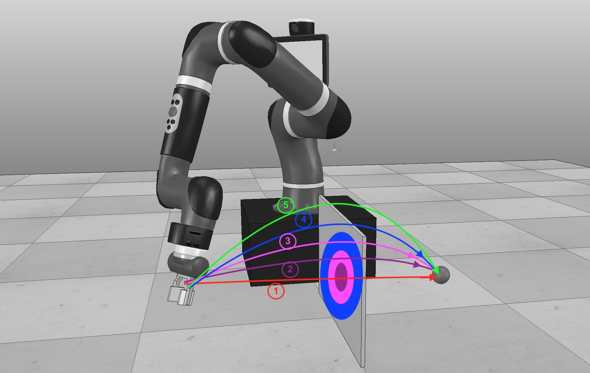
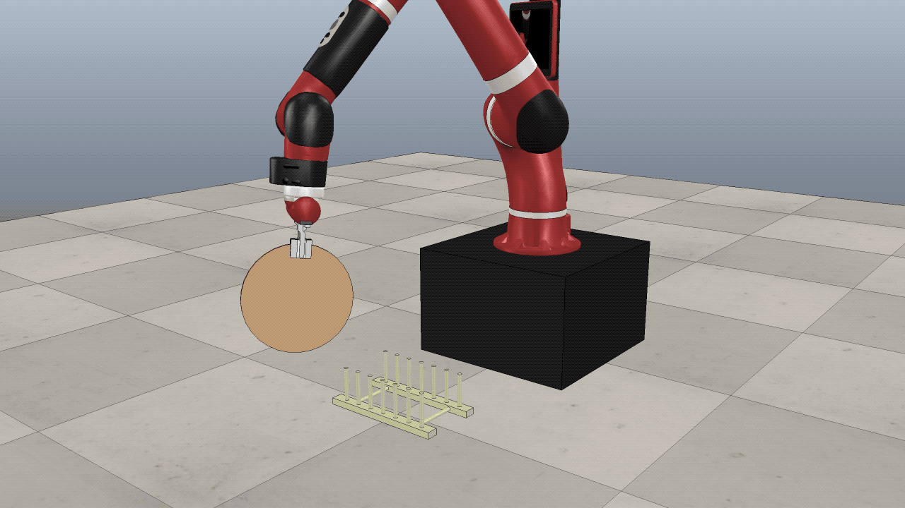
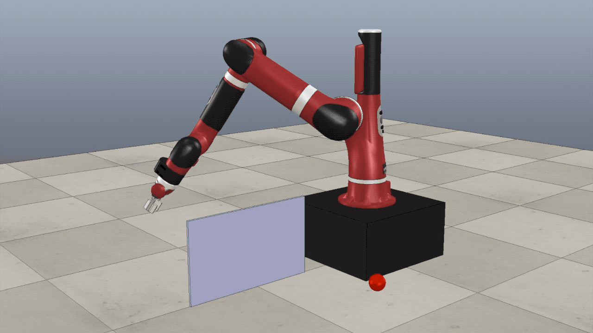
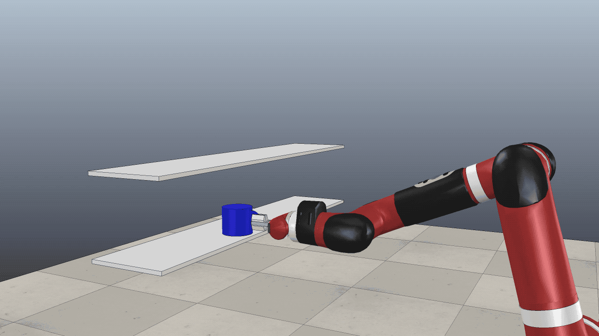

# CuRL - Curriculum Reinforcement Learning for Goal-Oriented Robot Control

Code archive of my MEng in Computing (Artificial Intelligence) final 
project, report [published here](https://www.imperial.ac.uk/computing/prospective-students/distinguished-projects/ug-prizes) 
\- [[PDF]](https://www.imperial.ac.uk/media/imperial-college/faculty-of-engineering/computing/public/1819-ug-projects/UglowH-CuRL-Curriculum-Reinforcement-Learning-for-Goal-Oriented-Robot-Control-v2.pdf).


The main outcome of the project is CuRL - a method for training policies
 to 
complete goal-oriented robotics tasks that are difficult to solve with 
state-of-the-art Deep Reinforcement Learning. Using a curriculum of simpler tasks, 
we progressively guide a policy towards being able to complete the desired full task. 



The above figure helps illustrate the method. We aim to train a robot to 
reach the target sphere while avoiding the wall. State-of-the-art approaches 
using Reinforcement Learning from scratch will struggle to learn to get past 
the wall. This is explained in far greater detail in the project report. With
 curriculum reinforcement learning, we initially remove the wall and the 
 robot can learn to move along the red trajectory. By sequentially adding 
 "parts" of the wall (represented by the coloured circles), we can guide the 
 policy so that the robot learns to follow the desired green trajectory.

The final method presented here and the earlier versions of it required 
significant changes to baseline implementations of RL
algorithms, in particular to support residual policy training. I hope making 
the code available here can help others working on similar projects. 

# Uses

During the project Curriculum Learning was used to tackle three main tasks:

- Placing a plate in a dish rack (both in simulation and reality)


- Reaching a point in space by moving over a wall

- Moving a mug from one shelf to a higher one.


# Method details
We describe the tasks tackled by this method as obstacle-driven goal-oriented 
tasks. The robot arm must move to a goal position, navigating obstacles in the 
scene in order to do so. The simplest version of such a task has no obstacles - 
a reacher environment. All tasks can be reduced to their reacher variant by 
making all obstacles "non-respondable" (they can be passed through). We 
create a curriculum of tasks that starts with the reacher variant and 
gradually increases the proportion of obstacles that are respondable. The 
final task in the curriculum is the true task, where all obstacles are 
respondable as they would be in reality.

Due to limitations of the simulation software used (V-REP) we do not 
programmatically edit the obstacles in a scene. Instead the intermediary 
variants of a task are created manually as separate scenes and given to the 
program to load.

### Algorithm
Many versions of this algorithm were attempted and can be seen in full in the
 project report. The final version is slightly different from the report 
 version, as more work has been done since the end of my degree. This final 
 version behaves as follows:
 - Training begins in simulation. State observations are a vector containing 
 the robot's 
 current joint angles and the position and orientation of the target (e.g. 
 the dish rack).
 Actions are a 6 dimensional vector, the 3-dimensional  
 position and orientation that the subject should move to in this simulation 
 step. This is sent to the simulation software which solves the inverse 
 kinematics to calculate the appropriate joint velocities which are then 
 applied to the robot.
 - A cartesian [controller](envs/wrappers.py) is used as an initial policy. Alone this 
 would move
  the tip of the robot arm directly toward the target at every 
  step.
 - A residual [policy](a2c_ppo_acktr/model.py) is trained with RL to augment 
 the actions output by the 
 initial 
 controller. This policy is trained on the non-respondable version of 
 the scene - the reacher variant.
 - Every few policy updates the policy is evaluated to calculate the success 
 rate (proportion of 
 successful 
 attempts at the task). Once the success rate reaches a target, training 
 moves to the next task in the curriculum.
 - At the end of the curriculum, the policy is trained on the full task until
  convergence.
  
The above could be run with a command such as:
```
python main.py --pipeline rack --num-steps 256 --eval-interval 4 --trg-succ-rate 70 --save-as <out_path>
```
This trains on the dish rack task, taking 256 simulation steps in between 
each policy update, evaluating the policy every 4 updates, and moving to the 
next stage of the curriculum after evaluation finds the policy >= 70% 
successful.

###Transferring to reality
Once that finishes you will have a trained policy that takes full state 
information and outputs actions. To use this policy on a real robot it will 
need to be able to produce these actions from only the joint angles (known in
 reality) and an image of the scene. [gather_training_images.py](gather_training_images.py) 
 can be used to rollout the trained policy 
 in simulation, creating a large dataset containing the state of the 
 environment, the action output by the policy, and simulated images of the 
 scene at every step. 
 
 This dataset is then used by [train_e2e.py](train_e2e.py) to train an 
 end-to-end controller 
 with supervised 
 learning to approximate the full state policy on images and partial state 
 information. This controller is usable by a real robot.
 
 
# Repository details

This project uses PPO as its main RL algorithm. [ikostrikov's implementation](https://github.com/ikostrikov/pytorch-a2c-ppo-acktr-gail) was used as a starting point for this repository. ikostrikov_license.txt contains the license for this implementation. The project was forked at commit ddb89a5c - any changes since then are my own.
That repository also implements the A2C and KFAC algorithms. Though they were
 not used in this project their implementations are left intact here.
 
Environment implementations can be found in the [envs](envs) directory. A 
large selection of V-REP scenes created over the course of the project can be
 found in [scenes](scenes). Their filenames are used to specify curricula in 
 [pipelines.py](envs/pipelines.py). [enjoy.py](enjoy.py) can be used to 
 execute a trained policy and observe its behaviour.

## Requirements

* Python 3
* [PyTorch](http://pytorch.org/)
* [OpenAI baselines](https://github.com/openai/baselines)

In order to install requirements, follow:

```bash
# Pytorch and other requirements
pip install -r requirements.txt

# Baselines (with some personal edits)
git clone https://github.com/harry-uglow/baselines.git
cd baselines
pip install -e .
```

[Install V-REP](http://www.coppeliarobotics.com/previousVersions), move 
remoteApi.so (or .dylib) to root folder.

## Branches
- master - most recent code is here, commented, in Python 3.7
- reality - code used to run trained policies on a real Sawyer robot. 
Branched and written in Python 2.7 because required packages for connecting 
to robot are Python 2 ONLY.
- joint-velocity-control - archived, marks the last point where policies 
directly output joint velocities, rather than target position. Changed as this 
was bias towards base joints which have a greater effect on end position. 
Left here in case you find it useful.


# Questions / Problems
Though I'm no longer actively developing on this project (least of all I no 
longer have access to the kind of hardware required to run RL experiments), I
am happy to answer any questions or look in to any problems you may find. 
[Raise an issue](https://github.com/harry-uglow/Curriculum-Reinforcement-Learning/issues/new) and I'll do my best to respond quickly. Thanks for reading!
